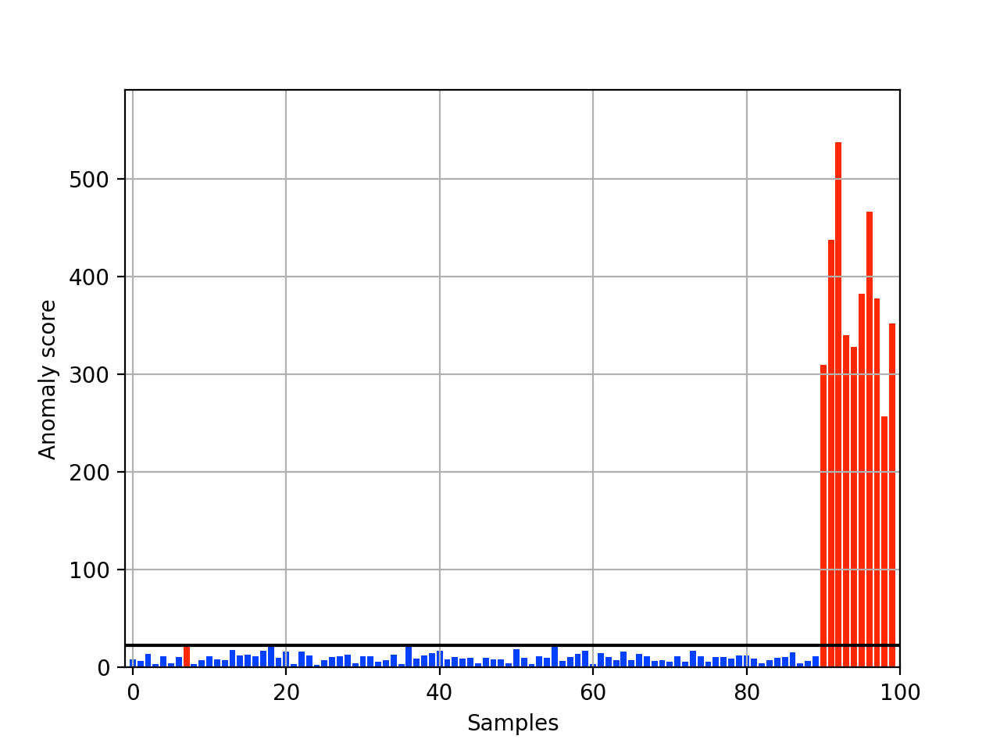

.. image:: https://travis-ci.org/Y-oHr-N/kenchi.svg?branch=master
    :target: https://travis-ci.org/Y-oHr-N/kenchi

.. image:: https://ci.appveyor.com/api/projects/status/5cjkl0jrxo7gmug0/branch/master?svg=true
    :target: https://ci.appveyor.com/project/Y-oHr-N/kenchi/branch/master

.. image:: https://coveralls.io/repos/github/Y-oHr-N/kenchi/badge.svg?branch=master
    :target: https://coveralls.io/github/Y-oHr-N/kenchi?branch=master

.. image:: https://codeclimate.com/github/Y-oHr-N/kenchi/badges/gpa.svg
    :target: https://codeclimate.com/github/Y-oHr-N/kenchi

.. image:: https://badge.fury.io/py/kenchi.svg
    :target: https://badge.fury.io/py/kenchi

.. image:: https://anaconda.org/Y_oHr_N/kenchi/badges/version.svg
    :target: https://anaconda.org/Y_oHr_N/kenchi

.. image:: https://readthedocs.org/projects/kenchi/badge/?version=latest
    :target: http://kenchi.readthedocs.io/en/latest/?badge=latest

kenchi
======

This is a set of python modules for anomaly detection.

Requirements
------------

-  Python (>=3.5)
-  matplotlib (>=2.0.2)
-  numpy (>=1.11.2)
-  pandas (>=0.20.3)
-  scikit-learn (>=0.18.0)
-  scipy (>=0.18.1)

Installation
------------

You can install via ``pip``

::

    pip install kenchi

or ``conda``.

::

    conda install -c y_ohr_n kenchi

Usage
-----

.. code:: python

    import matplotlib.pyplot as plt
    import numpy as np
    from kenchi.datasets import make_blobs_with_outliers
    from kenchi.outlier_detection import GaussianOutlierDetector

    train_size       = 1000
    test_size        = 100
    n_outliers       = 10
    n_features       = 10
    centers          = np.zeros((1, n_features))
    random_state     = np.random.RandomState(0)

    # Generate the training data
    X_train, _       = make_blobs_with_outliers(
        n_inliers    = train_size,
        n_outliers   = 0,
        n_features   = n_features,
        centers      = centers,
        random_state = random_state
    )

    # Generate the test data that contains outliers
    X_test, _        = make_blobs_with_outliers(
        n_inliers    = test_size - n_outliers,
        n_outliers   = n_outliers,
        n_features   = n_features,
        centers      = centers,
        shuffle      = False,
        random_state = random_state
    )

    # Fit the model according to the given training data
    det              = GaussianOutlierDetector().fit(X_train)

    # Plot anomaly scores for test samples
    det.plot_anomaly_score(X_test)

    plt.show()

License
-------

The MIT License (MIT)

Copyright (c) 2017 Kon
